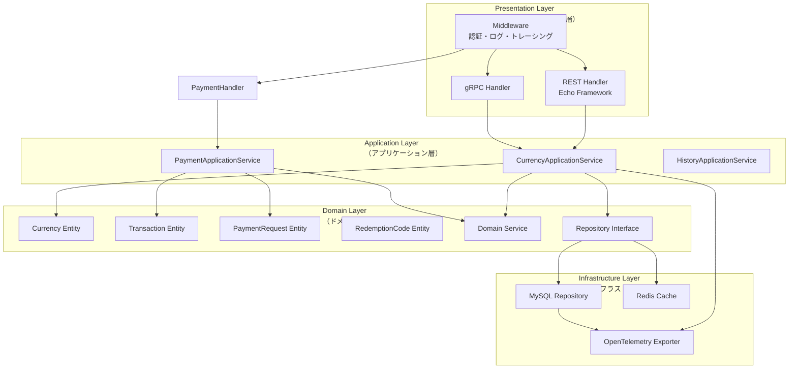
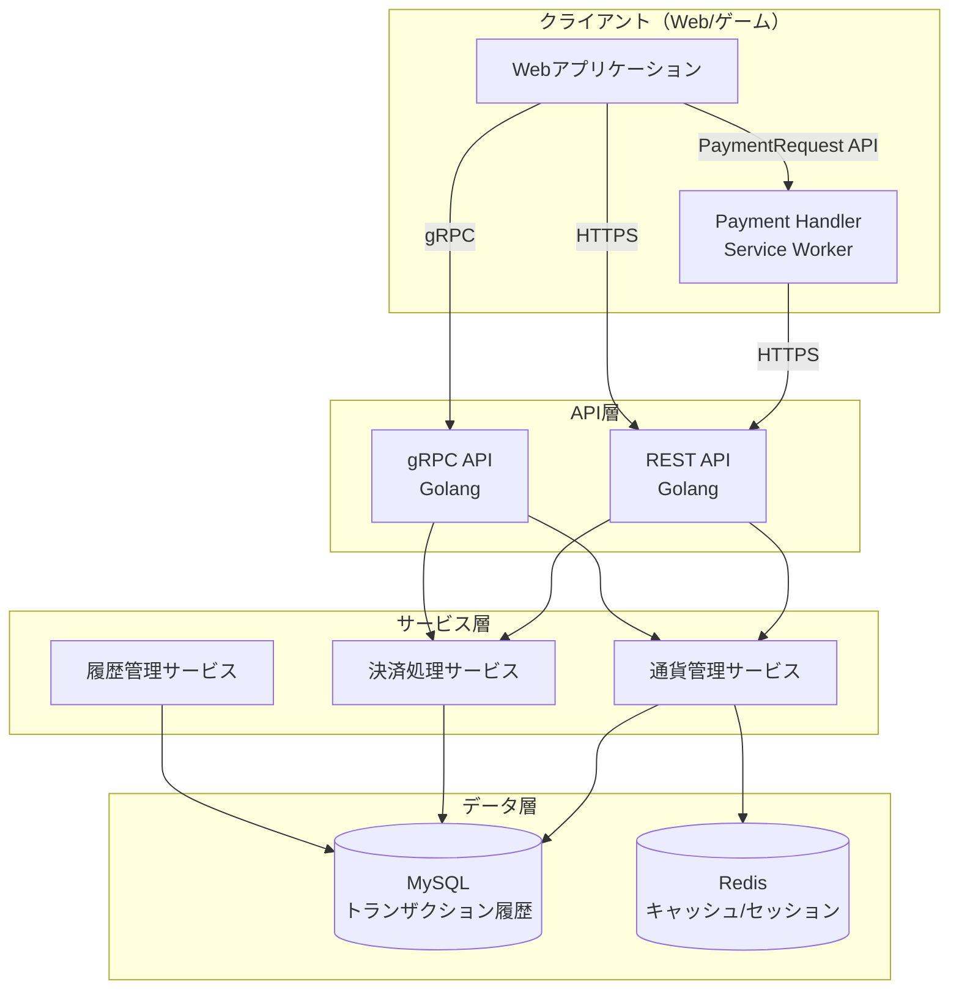
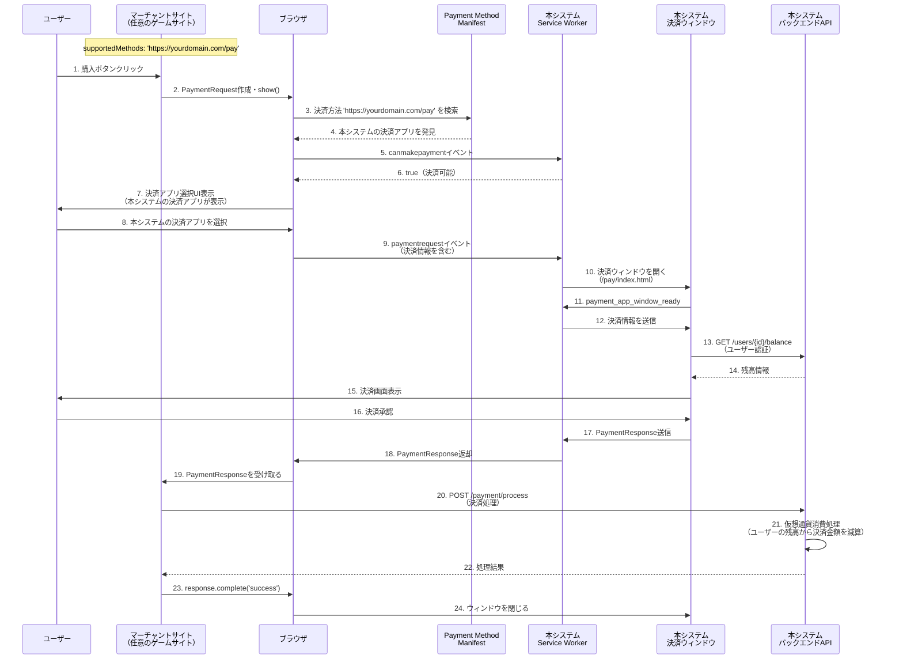

# タスク02: アーキテクチャ

## 2.1 DDD・クリーンアーキテクチャ設計

本システムはドメイン駆動設計（DDD）とクリーンアーキテクチャの原則に基づいて設計されます。

### 2.1.1 レイヤー構成



### 2.1.2 ディレクトリ構造

```
internal/
├── domain/                    # ドメイン層
│   ├── currency/             # 通貨ドメイン
│   │   ├── currency.go       # Currency エンティティ
│   │   ├── currency_type.go  # CurrencyType 値オブジェクト
│   │   └── repository.go     # CurrencyRepository インターフェース
│   ├── transaction/          # トランザクションドメイン
│   │   ├── transaction.go    # Transaction エンティティ
│   │   ├── transaction_type.go
│   │   └── repository.go
│   ├── payment_request/      # PaymentRequestドメイン
│   │   ├── payment_request.go
│   │   └── repository.go
│   ├── redemption_code/      # コード引き換えドメイン
│   │   ├── redemption_code.go
│   │   ├── code_type.go
│   │   └── repository.go
│   └── service/              # ドメインサービス
│       └── currency_service.go
├── application/              # アプリケーション層
│   ├── currency/            # 通貨ユースケース
│   │   ├── service.go       # CurrencyApplicationService
│   │   └── dto.go           # DTO定義
│   ├── payment/             # 決済ユースケース
│   │   ├── service.go
│   │   └── dto.go
│   └── history/             # 履歴ユースケース
│       ├── service.go
│       └── dto.go
├── infrastructure/          # インフラストラクチャ層
│   ├── persistence/        # 永続化
│   │   ├── mysql/           # MySQL実装
│   │   │   ├── currency_repository.go
│   │   │   ├── transaction_repository.go
│   │   │   ├── payment_request_repository.go
│   │   │   └── redemption_code_repository.go
│   │   └── redis/            # Redis実装
│   ├── observability/       # 可観測性
│   │   ├── otel/            # OpenTelemetry
│   │   │   ├── tracer.go
│   │   │   ├── meter.go
│   │   │   └── logger.go
│   │   └── middleware/      # ミドルウェア
│   │       ├── tracing.go
│   │       ├── metrics.go
│   │       └── logging.go
│   └── config/              # 設定管理
│       └── config.go
└── presentation/            # プレゼンテーション層
    ├── rest/                # REST API
    │   ├── handler/         # Echo Handler
    │   │   ├── currency_handler.go
    │   │   ├── payment_handler.go
    │   │   ├── code_redemption_handler.go
    │   │   └── history_handler.go
    │   ├── middleware/      # Echo Middleware
    │   │   ├── auth.go
    │   │   ├── tracing.go
    │   │   └── error_handler.go
    │   └── router.go        # ルーティング設定
    ├── payment_handler/     # Payment Handler（プロバイダー側）
    │   ├── service_worker/  # Service Worker
    │   │   └── sw-payment-handler.js
    │   ├── payment_app/     # 決済アプリウィンドウ
    │   │   ├── index.html
    │   │   └── payment-app.js
    │   ├── manifest/        # マニフェストファイル
    │   │   ├── payment-manifest.json
    │   │   └── manifest.json
    │   └── static/          # 静的ファイル
    │       └── icon.png
    ├── grpc/                # gRPC API
    │   ├── handler/
    │   └── server.go
    └── openapi/             # OpenAPI仕様
        └── spec.yaml
```

### 2.1.3 ドメインモデル

**Currency（通貨）エンティティ**

```go
// domain/currency/currency.go
type Currency struct {
    userID       string
    currencyType CurrencyType
    balance      int64 // 整数値（小数点なし）
    version      int   // 楽観的ロック用
}

func (c *Currency) Grant(amount int64) error {
    // ドメインロジック: 付与処理
    if amount <= 0 {
        return ErrInvalidAmount
    }
    c.balance += amount
    return nil
}

func (c *Currency) Consume(amount int64) error {
    // ドメインロジック: 消費処理（残高チェック含む）
    if amount <= 0 {
        return ErrInvalidAmount
    }
    if c.balance < amount {
        return ErrInsufficientBalance
    }
    c.balance -= amount
    return nil
}

// マイナス残高の考慮
// 運用によってはマイナス残高が発生する可能性があります。
// 例：返金処理、補填処理、手動調整などで、残高が0未満になる場合があります。
// マイナス残高を許可する場合は、Consumeメソッドの残高チェックを緩和するか、
// 別途マイナス残高を許可するメソッドを用意する必要があります。
// マイナス残高が発生した場合は、トランザクション履歴に記録し、
// 監視・アラートの対象とします。

// 消費優先順位の制御（無料通貨を優先、不足分を有料通貨で補う）
func (s *CurrencyApplicationService) ConsumeWithPriority(ctx context.Context, req *ConsumeRequest) (*ConsumeResponse, error) {
    // 1. 無料通貨の残高を確認
    // 2. 無料通貨で支払える分を消費
    // 3. 不足分があれば有料通貨から消費
    // 4. トランザクション履歴を記録
}
```

**Transaction（トランザクション）エンティティ**

```go
// domain/transaction/transaction.go
type Transaction struct {
    transactionID   string
    userID          string
    transactionType TransactionType
    currencyType    CurrencyType
    amount          int64 // 整数値（小数点なし）
    balanceBefore   int64 // 整数値（小数点なし）
    balanceAfter    int64 // 整数値（小数点なし）
    status          TransactionStatus
    metadata        map[string]interface{}
}
```

**RedemptionCode（引き換えコード）エンティティ**

```go
// domain/redemption_code/redemption_code.go
type RedemptionCode struct {
    code            string
    codeType        CodeType // "promotion", "gift", "event"
    currencyType    CurrencyType
    amount          int64 // 整数値（小数点なし）
    maxUses         int // 0 = 無制限
    currentUses     int
    validFrom       time.Time
    validUntil      time.Time
    status          CodeStatus // "active", "expired", "disabled"
    metadata        map[string]interface{}
}

func (rc *RedemptionCode) IsValid() bool {
    // 有効性チェック: 有効期限、使用回数、ステータス
}

func (rc *RedemptionCode) CanBeRedeemed() bool {
    // 引き換え可能かチェック
    if rc.status != CodeStatusActive {
        return false
    }
    if time.Now().Before(rc.validFrom) || time.Now().After(rc.validUntil) {
        return false
    }
    if rc.maxUses > 0 && rc.currentUses >= rc.maxUses {
        return false
    }
    return true
}

func (rc *RedemptionCode) Redeem() error {
    // 引き換え処理（使用回数を増やす）
    if !rc.CanBeRedeemed() {
        return ErrCodeNotRedeemable
    }
    rc.currentUses++
    return nil
}
```

### 2.1.4 依存関係の方向

- **依存関係の原則**: 外側のレイヤーは内側のレイヤーに依存するが、内側のレイヤーは外側のレイヤーに依存しない
- **インターフェース分離**: ドメイン層でリポジトリインターフェースを定義し、インフラストラクチャ層で実装
- **依存性注入**: コンストラクタインジェクションを使用して依存関係を注入

## 2.2 システム構成



## 2.3 PaymentRequest API統合フロー（プロバイダー側の視点）

本システムはPaymentRequest APIのプロバイダー側として機能します。


