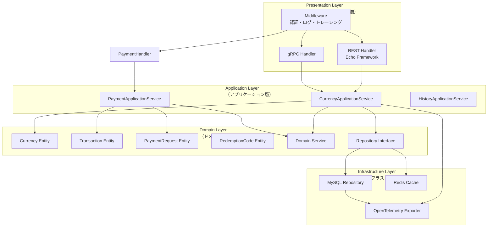
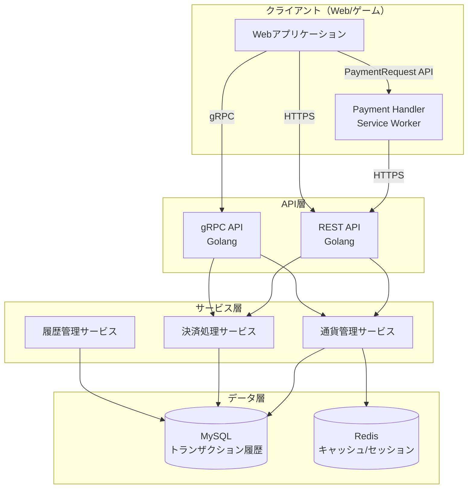
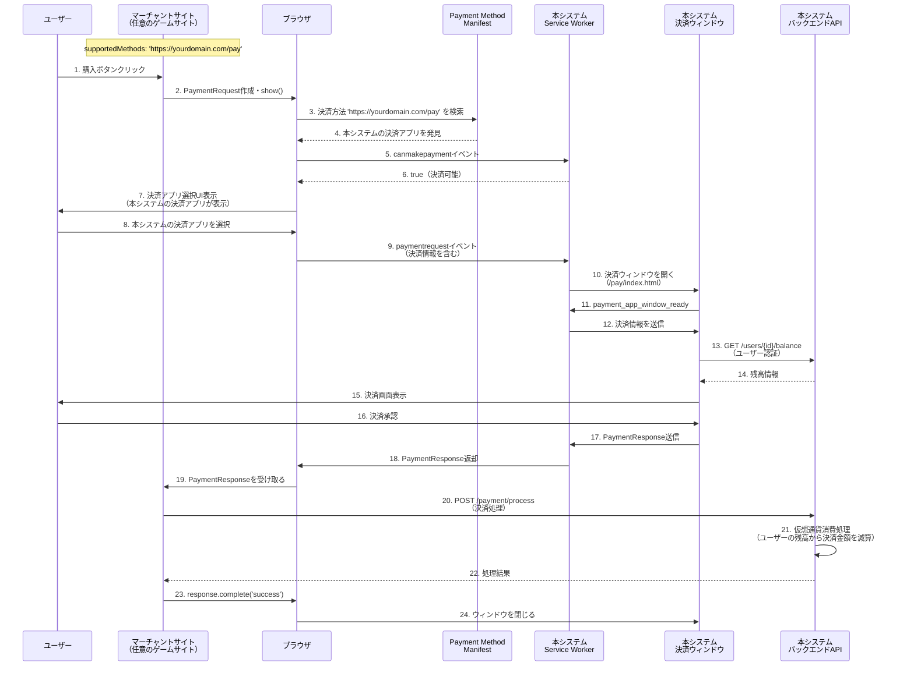

# PaymentRequest API プロバイダー実装 仮想通貨管理サービス 仕様書

## 1. システム概要

### 1.1 目的

Webサイト・ゲーム内専用の仮想通貨を管理するマイクロサービス。**PaymentRequest APIのプロバイダー側（決済アプリ側）**として機能し、`https://yourdomain.com/pay` という決済方法を提供します。マーチャントサイトはこの決済方法を `supportedMethods` に指定することで、ユーザーが保有する仮想通貨を使ってデジタル商品（ゲーム内アイテム、コンテンツなど）を購入できるようになります。

### 1.2 主要機能

- **PaymentRequest APIプロバイダー**: `https://yourdomain.com/pay` という決済方法を提供
- **Payment Handler実装**: Service Workerと決済アプリウィンドウによる決済処理
- **通貨管理**: 有償通貨（Paid Currency）と無償通貨（Free Currency）の2種類を管理
- **決済処理**: ユーザーが保有する仮想通貨を使ってデジタル商品を購入する際の決済処理
- **付与**: 無償通貨の配布、その他の方法による通貨の付与
- **消費**: 保有している通貨の使用（決済時の消費を含む）
- **コード引き換え**: プロモーションコードやギフトコードを引き換えて通貨を加算
- **補填**: 問題があった際の補填処理
- **失効**: アカウントBANなどによる通貨の失効
- **返金**: 決済返金時の有償通貨回収
- **履歴管理**: 全取引履歴の記録と過去状態の遡及

### 1.3 技術スタック

- **バックエンド**: Golang (Echo Framework + gRPC)
- **データベース**: MySQL
- **Payment Handler**: Service Worker + 決済アプリウィンドウ（JavaScript）
- **認証**: JWT トークンベース認証
- **可観測性**: OpenTelemetry (トレーシング、メトリクス、ログ)
- **API仕様**: OpenAPI 3.0 (Swagger/Redoc)

## 2. アーキテクチャ

### 2.1 DDD・クリーンアーキテクチャ設計

本システムはドメイン駆動設計（DDD）とクリーンアーキテクチャの原則に基づいて設計されます。

#### 2.1.1 レイヤー構成



#### 2.1.2 ディレクトリ構造

```
internal/
├── domain/                    # ドメイン層
│   ├── currency/             # 通貨ドメイン
│   │   ├── currency.go       # Currency エンティティ
│   │   ├── currency_type.go  # CurrencyType 値オブジェクト
│   │   └── repository.go     # CurrencyRepository インターフェース
│   ├── transaction/          # トランザクションドメイン
│   │   ├── transaction.go    # Transaction エンティティ
│   │   ├── transaction_type.go
│   │   └── repository.go
│   ├── payment_request/      # PaymentRequestドメイン
│   │   ├── payment_request.go
│   │   └── repository.go
│   ├── redemption_code/      # コード引き換えドメイン
│   │   ├── redemption_code.go
│   │   ├── code_type.go
│   │   └── repository.go
│   └── service/              # ドメインサービス
│       └── currency_service.go
├── application/              # アプリケーション層
│   ├── currency/            # 通貨ユースケース
│   │   ├── service.go       # CurrencyApplicationService
│   │   └── dto.go           # DTO定義
│   ├── payment/             # 決済ユースケース
│   │   ├── service.go
│   │   └── dto.go
│   └── history/             # 履歴ユースケース
│       ├── service.go
│       └── dto.go
├── infrastructure/          # インフラストラクチャ層
│   ├── persistence/        # 永続化
│   │   ├── mysql/           # MySQL実装
│   │   │   ├── currency_repository.go
│   │   │   ├── transaction_repository.go
│   │   │   ├── payment_request_repository.go
│   │   │   └── redemption_code_repository.go
│   │   └── redis/            # Redis実装
│   ├── observability/       # 可観測性
│   │   ├── otel/            # OpenTelemetry
│   │   │   ├── tracer.go
│   │   │   ├── meter.go
│   │   │   └── logger.go
│   │   └── middleware/      # ミドルウェア
│   │       ├── tracing.go
│   │       ├── metrics.go
│   │       └── logging.go
│   └── config/              # 設定管理
│       └── config.go
└── presentation/            # プレゼンテーション層
    ├── rest/                # REST API
    │   ├── handler/         # Echo Handler
    │   │   ├── currency_handler.go
    │   │   ├── payment_handler.go
    │   │   ├── code_redemption_handler.go
    │   │   └── history_handler.go
    │   ├── middleware/      # Echo Middleware
    │   │   ├── auth.go
    │   │   ├── tracing.go
    │   │   └── error_handler.go
    │   └── router.go        # ルーティング設定
    ├── payment_handler/     # Payment Handler（プロバイダー側）
    │   ├── service_worker/  # Service Worker
    │   │   └── sw-payment-handler.js
    │   ├── payment_app/     # 決済アプリウィンドウ
    │   │   ├── index.html
    │   │   └── payment-app.js
    │   ├── manifest/        # マニフェストファイル
    │   │   ├── payment-manifest.json
    │   │   └── manifest.json
    │   └── static/          # 静的ファイル
    │       └── icon.png
    ├── grpc/                # gRPC API
    │   ├── handler/
    │   └── server.go
    └── openapi/             # OpenAPI仕様
        └── spec.yaml
```

#### 2.1.3 ドメインモデル

**Currency（通貨）エンティティ**

```go
// domain/currency/currency.go
type Currency struct {
    userID       string
    currencyType CurrencyType
    balance      int64 // 整数値（小数点なし）
    version      int   // 楽観的ロック用
}

func (c *Currency) Grant(amount int64) error {
    // ドメインロジック: 付与処理
    if amount <= 0 {
        return ErrInvalidAmount
    }
    c.balance += amount
    return nil
}

func (c *Currency) Consume(amount int64) error {
    // ドメインロジック: 消費処理（残高チェック含む）
    if amount <= 0 {
        return ErrInvalidAmount
    }
    if c.balance < amount {
        return ErrInsufficientBalance
    }
    c.balance -= amount
    return nil
}

// マイナス残高の考慮
// 運用によってはマイナス残高が発生する可能性があります。
// 例：返金処理、補填処理、手動調整などで、残高が0未満になる場合があります。
// マイナス残高を許可する場合は、Consumeメソッドの残高チェックを緩和するか、
// 別途マイナス残高を許可するメソッドを用意する必要があります。
// マイナス残高が発生した場合は、トランザクション履歴に記録し、
// 監視・アラートの対象とします。

// 消費優先順位の制御（無料通貨を優先、不足分を有料通貨で補う）
func (s *CurrencyApplicationService) ConsumeWithPriority(ctx context.Context, req *ConsumeRequest) (*ConsumeResponse, error) {
    // 1. 無料通貨の残高を確認
    // 2. 無料通貨で支払える分を消費
    // 3. 不足分があれば有料通貨から消費
    // 4. トランザクション履歴を記録
}
```

**Transaction（トランザクション）エンティティ**

```go
// domain/transaction/transaction.go
type Transaction struct {
    transactionID   string
    userID          string
    transactionType TransactionType
    currencyType    CurrencyType
    amount          int64 // 整数値（小数点なし）
    balanceBefore   int64 // 整数値（小数点なし）
    balanceAfter    int64 // 整数値（小数点なし）
    status          TransactionStatus
    metadata        map[string]interface{}
}
```

**RedemptionCode（引き換えコード）エンティティ**

```go
// domain/redemption_code/redemption_code.go
type RedemptionCode struct {
    code            string
    codeType        CodeType // "promotion", "gift", "event"
    currencyType    CurrencyType
    amount          int64 // 整数値（小数点なし）
    maxUses         int // 0 = 無制限
    currentUses     int
    validFrom       time.Time
    validUntil      time.Time
    status          CodeStatus // "active", "expired", "disabled"
    metadata        map[string]interface{}
}

func (rc *RedemptionCode) IsValid() bool {
    // 有効性チェック: 有効期限、使用回数、ステータス
}

func (rc *RedemptionCode) CanBeRedeemed() bool {
    // 引き換え可能かチェック
    if rc.status != CodeStatusActive {
        return false
    }
    if time.Now().Before(rc.validFrom) || time.Now().After(rc.validUntil) {
        return false
    }
    if rc.maxUses > 0 && rc.currentUses >= rc.maxUses {
        return false
    }
    return true
}

func (rc *RedemptionCode) Redeem() error {
    // 引き換え処理（使用回数を増やす）
    if !rc.CanBeRedeemed() {
        return ErrCodeNotRedeemable
    }
    rc.currentUses++
    return nil
}
```

#### 2.1.4 依存関係の方向

- **依存関係の原則**: 外側のレイヤーは内側のレイヤーに依存するが、内側のレイヤーは外側のレイヤーに依存しない
- **インターフェース分離**: ドメイン層でリポジトリインターフェースを定義し、インフラストラクチャ層で実装
- **依存性注入**: コンストラクタインジェクションを使用して依存関係を注入

### 2.2 システム構成



### 2.2 PaymentRequest API統合フロー（プロバイダー側の視点）

本システムはPaymentRequest APIのプロバイダー側として機能します。



## 3. データベース設計

### 3.1 テーブル構成

#### users（ユーザー）

```sql
CREATE TABLE users (
    id BIGINT PRIMARY KEY AUTO_INCREMENT,
    user_id VARCHAR(255) UNIQUE NOT NULL,
    created_at TIMESTAMP DEFAULT CURRENT_TIMESTAMP,
    updated_at TIMESTAMP DEFAULT CURRENT_TIMESTAMP ON UPDATE CURRENT_TIMESTAMP,
    INDEX idx_user_id (user_id)
);
```

#### currency_balances（通貨残高）

```sql
CREATE TABLE currency_balances (
    id BIGINT PRIMARY KEY AUTO_INCREMENT,
    user_id VARCHAR(255) NOT NULL,
    currency_type ENUM('paid', 'free') NOT NULL,
    balance BIGINT NOT NULL DEFAULT 0, -- 整数値（小数点なし）、マイナス値を許可
    version INT NOT NULL DEFAULT 0, -- 楽観的ロック用
    updated_at TIMESTAMP DEFAULT CURRENT_TIMESTAMP ON UPDATE CURRENT_TIMESTAMP,
    UNIQUE KEY uk_user_currency (user_id, currency_type),
    FOREIGN KEY (user_id) REFERENCES users(user_id),
    INDEX idx_user_id (user_id)
);
```

**注意**: `balance`カラムはマイナス値を許可します。運用によっては返金処理、補填処理、手動調整などでマイナス残高が発生する可能性があります。マイナス残高が発生した場合は、トランザクション履歴に記録し、監視・アラートの対象とします。

#### transactions（トランザクション履歴）

```sql
CREATE TABLE transactions (
    id BIGINT PRIMARY KEY AUTO_INCREMENT,
    transaction_id VARCHAR(255) UNIQUE NOT NULL,
    user_id VARCHAR(255) NOT NULL,
    transaction_type ENUM('grant', 'consume', 'refund', 'expire', 'compensate') NOT NULL,
    currency_type ENUM('paid', 'free') NOT NULL,
    amount BIGINT NOT NULL, -- 整数値（小数点なし）
    balance_before BIGINT NOT NULL, -- 整数値（小数点なし）
    balance_after BIGINT NOT NULL, -- 整数値（小数点なし）
    status ENUM('pending', 'completed', 'failed', 'cancelled') NOT NULL,
    payment_request_id VARCHAR(255), -- PaymentRequest APIのID
    metadata JSON, -- 追加情報（商品ID、理由など）
    created_at TIMESTAMP DEFAULT CURRENT_TIMESTAMP,
    updated_at TIMESTAMP DEFAULT CURRENT_TIMESTAMP ON UPDATE CURRENT_TIMESTAMP,
    FOREIGN KEY (user_id) REFERENCES users(user_id),
    INDEX idx_user_id (user_id),
    INDEX idx_transaction_id (transaction_id),
    INDEX idx_payment_request_id (payment_request_id),
    INDEX idx_created_at (created_at)
);
```

#### payment_requests（PaymentRequest記録）

```sql
CREATE TABLE payment_requests (
    id BIGINT PRIMARY KEY AUTO_INCREMENT,
    payment_request_id VARCHAR(255) UNIQUE NOT NULL,
    user_id VARCHAR(255) NOT NULL,
    amount BIGINT NOT NULL, -- 整数値（小数点なし）
    currency VARCHAR(10) NOT NULL DEFAULT 'JPY',
    currency_type ENUM('paid', 'free') NOT NULL,
    status ENUM('pending', 'completed', 'failed', 'cancelled') NOT NULL,
    payment_method_data JSON, -- PaymentRequestのmethodData
    details JSON, -- PaymentRequestのdetails
    response JSON, -- PaymentResponse
    created_at TIMESTAMP DEFAULT CURRENT_TIMESTAMP,
    updated_at TIMESTAMP DEFAULT CURRENT_TIMESTAMP ON UPDATE CURRENT_TIMESTAMP,
    FOREIGN KEY (user_id) REFERENCES users(user_id),
    INDEX idx_payment_request_id (payment_request_id),
    INDEX idx_user_id (user_id),
    INDEX idx_status (status)
);
```

#### redemption_codes（引き換えコード）

```sql
CREATE TABLE redemption_codes (
    id BIGINT PRIMARY KEY AUTO_INCREMENT,
    code VARCHAR(255) UNIQUE NOT NULL,
    code_type ENUM('promotion', 'gift', 'event') NOT NULL,
    currency_type ENUM('paid', 'free') NOT NULL,
    amount BIGINT NOT NULL, -- 整数値（小数点なし）
    max_uses INT NOT NULL DEFAULT 0, -- 0 = 無制限
    current_uses INT NOT NULL DEFAULT 0,
    valid_from TIMESTAMP NOT NULL,
    valid_until TIMESTAMP NOT NULL,
    status ENUM('active', 'expired', 'disabled') NOT NULL DEFAULT 'active',
    metadata JSON, -- 追加情報（説明、キャンペーンIDなど）
    created_at TIMESTAMP DEFAULT CURRENT_TIMESTAMP,
    updated_at TIMESTAMP DEFAULT CURRENT_TIMESTAMP ON UPDATE CURRENT_TIMESTAMP,
    INDEX idx_code (code),
    INDEX idx_status (status),
    INDEX idx_valid_until (valid_until)
);
```

#### code_redemptions（コード引き換え履歴）

```sql
CREATE TABLE code_redemptions (
    id BIGINT PRIMARY KEY AUTO_INCREMENT,
    redemption_id VARCHAR(255) UNIQUE NOT NULL,
    code VARCHAR(255) NOT NULL,
    user_id VARCHAR(255) NOT NULL,
    transaction_id VARCHAR(255) NOT NULL, -- transactionsテーブルへの参照
    redeemed_at TIMESTAMP DEFAULT CURRENT_TIMESTAMP,
    FOREIGN KEY (user_id) REFERENCES users(user_id),
    FOREIGN KEY (code) REFERENCES redemption_codes(code),
    FOREIGN KEY (transaction_id) REFERENCES transactions(transaction_id),
    INDEX idx_code (code),
    INDEX idx_user_id (user_id),
    INDEX idx_transaction_id (transaction_id),
    UNIQUE KEY uk_user_code (user_id, code) -- 同一ユーザーが同じコードを複数回引き換えできないように
);
```

## 4. API仕様

### 4.1 OpenAPI仕様（Echo Framework）

Echo Frameworkを使用してREST APIを実装し、OpenAPI 3.0仕様に準拠したAPIドキュメントを提供します。

#### 4.1.1 OpenAPI仕様ファイル構造

```yaml
# openapi/spec.yaml
openapi: 3.0.3
info:
  title: Virtual Currency Management API
  version: 1.0.0
  description: PaymentRequest API対応の仮想通貨管理API
servers:
  - url: https://api.yourdomain.com/v1
    description: Production server
paths:
  /users/{user_id}/balance:
    get:
      summary: 通貨残高取得
      operationId: getBalance
      parameters:
        - name: user_id
          in: path
          required: true
          schema:
            type: string
      responses:
        '200':
          description: 成功
          content:
            application/json:
              schema:
                $ref: '#/components/schemas/BalanceResponse'
  /users/{user_id}/grant:
    post:
      summary: 通貨付与
      operationId: grantCurrency
      requestBody:
        required: true
        content:
          application/json:
            schema:
              $ref: '#/components/schemas/GrantRequest'
      responses:
        '200':
          description: 成功
          content:
            application/json:
              schema:
                $ref: '#/components/schemas/GrantResponse'
  /codes/redeem:
    post:
      summary: コード引き換え
      operationId: redeemCode
      requestBody:
        required: true
        content:
          application/json:
            schema:
              $ref: '#/components/schemas/RedeemCodeRequest'
      responses:
        '200':
          description: 成功
          content:
            application/json:
              schema:
                $ref: '#/components/schemas/RedeemCodeResponse'
        '400':
          description: 無効なコードまたは既に使用済み
        '404':
          description: コードが見つからない
components:
  schemas:
    BalanceResponse:
      type: object
      properties:
        user_id:
          type: string
        balances:
          type: object
          properties:
            paid:
              type: string
            free:
              type: string
    GrantRequest:
      type: object
      required:
        - currency_type
        - amount
      properties:
        currency_type:
          type: string
          enum: [paid, free]
        amount:
          type: string
        reason:
          type: string
        metadata:
          type: object
    RedeemCodeRequest:
      type: object
      required:
        - code
        - user_id
      properties:
        code:
          type: string
          description: 引き換えコード
        user_id:
          type: string
          description: ユーザーID
    RedeemCodeResponse:
      type: object
      properties:
        redemption_id:
          type: string
        transaction_id:
          type: string
        code:
          type: string
        currency_type:
          type: string
          enum: [paid, free]
        amount:
          type: string
        balance_after:
          type: string
        status:
          type: string
```

#### 4.1.2 Echo Frameworkでの実装

```go
// presentation/rest/handler/currency_handler.go
package handler

import (
    "github.com/labstack/echo/v4"
    "github.com/getkin/kin-openapi/openapi3"
    "github.com/oapi-codegen/echo-middleware"
)

func SetupRoutes(e *echo.Echo, swagger *openapi3.T) {
    // OpenAPI仕様の読み込み
    e.Use(echomiddleware.OapiRequestValidator(swagger))
    
    // ルーティング
    api := e.Group("/api/v1")
    api.GET("/users/:user_id/balance", getBalance)
    api.POST("/users/:user_id/grant", grantCurrency)
    api.POST("/users/:user_id/consume", consumeCurrency)
    api.POST("/payment/process", processPayment)
    api.POST("/codes/redeem", redeemCode)
    api.GET("/users/:user_id/transactions", getTransactionHistory)
}

// OpenAPI仕様の自動生成（コード生成ツール使用）
// go generate で実行
//go:generate oapi-codegen -generate types,server -package openapi openapi/spec.yaml > openapi/generated.go
```

#### 4.1.3 Swagger UI / ReDoc統合

```go
// presentation/rest/router.go
import (
    "github.com/swaggo/echo-swagger"
    "github.com/swaggo/swag"
)

func SetupSwagger(e *echo.Echo) {
    // Swagger UI
    e.GET("/swagger/*", echoSwagger.WrapHandler)
    
    // ReDoc
    e.Static("/redoc", "./docs/redoc")
    
    // OpenAPI仕様ファイルの配信
    e.GET("/openapi.yaml", func(c echo.Context) error {
        return c.File("./openapi/spec.yaml")
    })
    e.GET("/openapi.json", func(c echo.Context) error {
        return c.File("./openapi/spec.json")
    })
}
```

### 4.2 REST API エンドポイント

#### 4.1.1 通貨残高取得

```
GET /api/v1/users/{user_id}/balance
Authorization: Bearer {token}

Response:
{
  "user_id": "user123",
  "balances": {
    "paid": "1000",
    "free": "500"
  }
}
```

#### 4.1.2 通貨付与（無償）

```
POST /api/v1/users/{user_id}/grant
Authorization: Bearer {token}
Content-Type: application/json

Request:
{
  "currency_type": "free",
  "amount": "100.00",
  "reason": "イベント報酬",
  "metadata": {
    "event_id": "event_001"
  }
}

Response:
{
  "transaction_id": "txn_1234567890",
  "balance_after": "600.00",
  "status": "completed"
}
```

#### 4.1.3 通貨消費

##### 4.1.3.1 指定通貨タイプでの消費

```
POST /api/v1/users/{user_id}/consume
Authorization: Bearer {token}
Content-Type: application/json

Request:
{
  "currency_type": "paid",
  "amount": "50",
  "item_id": "item_001",
  "metadata": {
    "purchase_id": "purchase_001"
  }
}

Response:
{
  "transaction_id": "txn_1234567891",
  "balance_after": "950",
  "status": "completed"
}
```

##### 4.1.3.2 優先順位付き消費（無料通貨優先）

無料通貨を優先して使用し、不足分を有料通貨で補う消費処理。

```
POST /api/v1/users/{user_id}/consume
Authorization: Bearer {token}
Content-Type: application/json

Request:
{
  "currency_type": "auto",  // "auto"を指定すると優先順位制御が有効
  "amount": "150",
  "item_id": "item_001",
  "use_priority": true,  // 優先順位制御を有効化
  "metadata": {
    "purchase_id": "purchase_001"
  }
}

Response:
{
  "transaction_id": "txn_1234567891",
  "consumption_details": [
    {
      "currency_type": "free",
      "amount": "100",  // 無料通貨から消費
      "balance_before": "100",
      "balance_after": "0"
    },
    {
      "currency_type": "paid",
      "amount": "50",   // 有料通貨から消費（不足分）
      "balance_before": "1000",
      "balance_after": "950"
    }
  ],
  "total_consumed": "150",
  "status": "completed"
}
```

**消費ロジック**:

1. 無料通貨の残高を確認
2. 無料通貨で支払える分を消費
3. 不足分があれば有料通貨から消費
4. 各通貨タイプごとにトランザクション履歴を記録

#### 4.1.4 PaymentRequest処理（マーチャントから）

マーチャントサイトが決済を完了するために呼び出すAPIです。マーチャントは決済アプリウィンドウから返されたPaymentResponseを受け取り、このAPIを呼び出して決済処理を完了します。

**注意**: このAPIは決済金額をユーザーの仮想通貨残高から**消費**します。消費は**無料通貨を優先**し、不足分を有料通貨で補います。決済が完了すると、マーチャントサイトはユーザーにデジタル商品（ゲーム内アイテム、コンテンツなど）を提供します。

**注意**: このAPIは決済金額をユーザーの仮想通貨残高から**消費**します。消費は**無料通貨を優先**し、不足分を有料通貨で補います。決済が完了すると、マーチャントサイトはユーザーにデジタル商品（ゲーム内アイテム、コンテンツなど）を提供します。

```
POST /api/v1/payment/process
Authorization: Bearer {token}
Content-Type: application/json

Request:
{
  "payment_request_id": "pr_1234567890",
  "user_id": "user123",
  "method_name": "https://yourdomain.com/pay",
  "details": {
    "userId": "user123",
    "transactionId": "txn_abc123",
    "timestamp": 1234567890
  },
  "amount": "1000",
  "currency": "JPY"
}

Response:
{
  "transaction_id": "txn_1234567892",
  "payment_request_id": "pr_1234567890",
  "consumption_details": [
    {
      "currency_type": "free",
      "amount": "500",
      "balance_before": "500",
      "balance_after": "0"
    },
    {
      "currency_type": "paid",
      "amount": "500",
      "balance_before": "1500",
      "balance_after": "1000"
    }
  ],
  "total_consumed": "1000",
  "status": "completed"
}
```

**注意**: このAPIはマーチャントサイトから呼び出されます。決済アプリウィンドウからは残高確認APIのみを呼び出します。

#### 4.1.5 コード引き換え

```
POST /api/v1/codes/redeem
Authorization: Bearer {token}
Content-Type: application/json

Request:
{
  "code": "PROMO2024ABC",
  "user_id": "user123"
}

Response:
{
  "redemption_id": "red_1234567890",
  "transaction_id": "txn_1234567891",
  "code": "PROMO2024ABC",
  "currency_type": "free",
  "amount": "500",
  "balance_after": "1100",
  "status": "completed"
}

エラーレスポンス:
- 400: コードが無効、期限切れ、または既に使用済み
- 404: コードが見つからない
```

#### 4.1.6 トランザクション履歴取得

```
GET /api/v1/users/{user_id}/transactions
Authorization: Bearer {token}
Query Parameters:
  - limit: 取得件数（デフォルト: 50）
  - offset: オフセット（デフォルト: 0）
  - currency_type: 通貨種別フィルタ（paid/free）
  - transaction_type: 取引種別フィルタ

Response:
{
  "transactions": [
    {
      "transaction_id": "txn_1234567890",
      "transaction_type": "grant",
      "currency_type": "free",
      "amount": "100",
      "balance_before": "500",
      "balance_after": "600",
      "status": "completed",
      "created_at": "2024-01-01T00:00:00Z"
    }
  ],
  "total": 100,
  "limit": 50,
  "offset": 0
}
```

### 4.2 gRPC API定義（proto）

```protobuf
syntax = "proto3";

package currency;

service CurrencyService {
  rpc GetBalance(GetBalanceRequest) returns (GetBalanceResponse);
  rpc Grant(GrantRequest) returns (GrantResponse);
  rpc Consume(ConsumeRequest) returns (ConsumeResponse);
  rpc ProcessPayment(ProcessPaymentRequest) returns (ProcessPaymentResponse);
  rpc RedeemCode(RedeemCodeRequest) returns (RedeemCodeResponse);
  rpc GetTransactionHistory(GetTransactionHistoryRequest) returns (GetTransactionHistoryResponse);
}

message GetBalanceRequest {
  string user_id = 1;
}

message GetBalanceResponse {
  string user_id = 1;
  map<string, string> balances = 2; // "paid" => "1000", "free" => "500" (整数値の文字列)
}

message GrantRequest {
  string user_id = 1;
  string currency_type = 2; // "paid" or "free"
  string amount = 3; // 整数値の文字列（例: "100"）
  string reason = 4;
  map<string, string> metadata = 5;
}

message GrantResponse {
  string transaction_id = 1;
  string balance_after = 2; // 整数値の文字列（例: "600"）
  string status = 3;
}

message ConsumeRequest {
  string user_id = 1;
  string currency_type = 2; // "paid", "free", or "auto"
  string amount = 3; // 整数値の文字列（例: "50"）
  string item_id = 4;
  bool use_priority = 5; // 優先順位制御（無料通貨優先）
  map<string, string> metadata = 6;
}

message ConsumeResponse {
  string transaction_id = 1;
  repeated ConsumptionDetail consumption_details = 2; // 優先順位制御使用時
  string balance_after = 3; // 単一通貨タイプ消費時
  string total_consumed = 4; // 優先順位制御使用時
  string status = 5;
}

message ConsumptionDetail {
  string currency_type = 1; // "paid" or "free"
  string amount = 2; // 整数値の文字列
  string balance_before = 3; // 整数値の文字列
  string balance_after = 4; // 整数値の文字列
}

message ProcessPaymentRequest {
  string payment_request_id = 1;
  string user_id = 2;
  string method_name = 3;
  map<string, string> details = 4;
  string amount = 5;
  string currency = 6;
}

message ProcessPaymentResponse {
  string transaction_id = 1;
  string payment_request_id = 2;
  string balance_after = 3;
  string status = 4;
}

message RedeemCodeRequest {
  string code = 1;
  string user_id = 2;
}

message RedeemCodeResponse {
  string redemption_id = 1;
  string transaction_id = 2;
  string code = 3;
  string currency_type = 4;
  string amount = 5;
  string balance_after = 6;
  string status = 7;
}

message GetTransactionHistoryRequest {
  string user_id = 1;
  int32 limit = 2;
  int32 offset = 3;
  string currency_type = 4; // optional
  string transaction_type = 5; // optional
}

message GetTransactionHistoryResponse {
  repeated Transaction transactions = 1;
  int32 total = 2;
  int32 limit = 3;
  int32 offset = 4;
}

message Transaction {
  string transaction_id = 1;
  string transaction_type = 2;
  string currency_type = 3;
  string amount = 4; // 整数値の文字列（例: "100"）
  string balance_before = 5; // 整数値の文字列（例: "500"）
  string balance_after = 6; // 整数値の文字列（例: "600"）
  string status = 7;
  string created_at = 8;
}
```

## 5. PaymentRequest API プロバイダー実装

本システムはPaymentRequest APIのプロバイダー側（決済アプリ側）として機能します。`https://yourdomain.com/pay` という決済方法を提供し、マーチャントサイトがこの決済方法を使用できるようにします。

### 5.1 実装コンポーネント

#### 5.1.1 Payment Method Manifest

決済方法を定義するマニフェストファイル。`/pay/payment-manifest.json` として配信します。

**public/pay/payment-manifest.json**

```json
{
  "default_applications": ["https://yourdomain.com/pay/manifest.json"],
  "supported_origins": [
    "https://yourdomain.com",
    "https://game.yourdomain.com"
  ]
}
```

**HTTPヘッダーでの参照**

```go
// Echo Frameworkでの実装例
e.GET("/pay", func(c echo.Context) error {
    c.Response().Header().Set("Link", 
        `<https://yourdomain.com/pay/payment-manifest.json>; rel="payment-method-manifest"`)
    return c.File("public/pay/index.html")
})
```

#### 5.1.2 Web App Manifest

決済アプリの設定を定義するマニフェストファイル。

**public/pay/manifest.json**

```json
{
  "name": "YourGame Currency",
  "short_name": "GameCurrency",
  "icons": [{
    "src": "icon.png",
    "sizes": "48x48",
    "type": "image/png"
  }],
  "serviceworker": {
    "src": "sw-payment-handler.js",
    "use_cache": false
  }
}
```

#### 5.1.3 Service Worker実装

決済リクエストを処理するService Worker。

**public/pay/sw-payment-handler.js**

主要なイベントハンドラ：

- `canmakepayment`: 決済可能かどうかの確認
- `paymentrequest`: 決済リクエストの処理
- `message`: 決済アプリウィンドウからのメッセージ受信

実装の詳細は `docs/payment-request-api.md` を参照してください。

#### 5.1.4 決済アプリウィンドウ

ユーザーが決済を承認するためのUI。

**public/pay/index.html**: 決済アプリウィンドウのHTML

**public/pay/payment-app.js**: 決済アプリのJavaScript

主要な機能：

- ユーザー認証
- ユーザー残高の表示
- 決済情報の表示
- 決済承認/キャンセル
- Service Workerとの通信
- バックエンドAPIとの通信（残高確認）

### 5.2 ディレクトリ構造

```
public/
└── pay/                          # Payment Handler関連ファイル
    ├── payment-manifest.json     # Payment Method Manifest
    ├── manifest.json              # Web App Manifest
    ├── sw-payment-handler.js      # Service Worker
    ├── index.html                 # 決済アプリウィンドウ
    ├── payment-app.js             # 決済アプリJavaScript
    └── icon.png                   # アイコン
```

### 5.3 マーチャント側の使用例（参考）

マーチャントサイトは以下のように本システムの決済方法を使用します：

```javascript
// マーチャントサイト側の実装例（参考）
const supportedMethods = [{
  supportedMethods: 'https://yourdomain.com/pay'
}];

const details = {
  total: {
    label: '有償通貨購入',
    amount: {
      currency: 'JPY',
      value: '1000.00'
    }
  }
};

const request = new PaymentRequest(supportedMethods, details);
const response = await request.show();
// 決済処理APIを呼び出す
```

**注意**: 上記はマーチャント側の実装例です。本システムが実装するのは**プロバイダー側（決済アプリ側）**です。

## 6. 設計原則

### 6.1 完結型API

各APIは単一のリクエストで完結し、複数のAPI呼び出しを必要としない。

### 6.2 わりきった冪等性

- トランザクションIDによる冪等性保証
- 同じトランザクションIDでの重複リクエストは既存結果を返却

### 6.3 完全なログと過去状態遡及

- 全トランザクションを履歴テーブルに記録
- 任意の時点の残高を再計算可能
- 監査ログとして機能

### 6.4 購入毎の管理の分離

- 各PaymentRequestを独立したレコードとして管理
- 決済処理と通貨付与を分離

### 6.5 マイナス残高の考慮

- **マイナス残高の許可**: 運用によってはマイナス残高が発生する可能性があります
                                - 返金処理: 既に消費済みの通貨を返金する際、残高が0未満になる場合がある
                                - 補填処理: 問題があった際の補填で、既に消費された通貨を補填する場合
                                - 手動調整: 運用上の理由で手動で残高を調整する場合
                                - 失効処理: アカウントBANなどで通貨を失効させる際、既に消費済みの場合はマイナスになる可能性がある
- **マイナス残高の管理**:
                                - マイナス残高が発生した場合は、必ずトランザクション履歴に記録する
                                - マイナス残高の発生を監視し、アラートを設定する
                                - マイナス残高の許容範囲や上限を設定する（必要に応じて）
                                - マイナス残高の解消方法を明確にする（例：次回の付与時に自動的に相殺）

## 7. セキュリティ

### 7.1 認証・認可

- JWT トークンベース認証
- ユーザーIDの検証
- レート制限（Rate Limiting）

### 7.2 データ整合性

- データベーストランザクションによる整合性保証
- 楽観的ロック（versionカラム）による同時更新制御
- 二重決済防止（PaymentRequest IDの一意性）

### 7.3 監査

- 全操作のログ記録
- 不正検知のための異常パターン監視

## 8. エラーハンドリング

### 8.1 エラーコード体系

- `INSUFFICIENT_BALANCE`: 残高不足
- `INVALID_AMOUNT`: 無効な金額
- `DUPLICATE_TRANSACTION`: 重複トランザクション
- `PAYMENT_REQUEST_NOT_FOUND`: PaymentRequestが見つからない
- `PAYMENT_REQUEST_ALREADY_PROCESSED`: 既に処理済み
- `CODE_NOT_FOUND`: 引き換えコードが見つからない
- `CODE_EXPIRED`: 引き換えコードが期限切れ
- `CODE_ALREADY_USED`: 引き換えコードが既に使用済み
- `CODE_DISABLED`: 引き換えコードが無効化されている
- `CODE_MAX_USES_REACHED`: 引き換えコードの使用上限に達している
- `USER_ALREADY_REDEEMED`: ユーザーが既にこのコードを引き換え済み
- `INTERNAL_ERROR`: 内部エラー

### 8.2 リトライ戦略

- 冪等性を保証することで、安全にリトライ可能
- 指数バックオフによるリトライ間隔制御

## 9. テスト戦略

### 9.1 単体テスト

- 各サービス関数のテスト
- データベース操作のモック

### 9.2 統合テスト

- APIエンドポイントのテスト
- データベース統合テスト

### 9.3 E2Eテスト

- PaymentRequest APIプロバイダー側のフローテスト
- 実際のService Workerとブラウザを使用したテスト
- マーチャントサイトからの決済リクエストのシミュレーション
- 決済アプリウィンドウの動作確認

## 10. デプロイメント

### 10.1 環境

- 開発環境
- ステージング環境
- 本番環境

### 10.2 監視と可観測性

#### 10.2.1 OpenTelemetry統合

OpenTelemetryを使用して、分散トレーシング、メトリクス、ログを統合的に管理します。

**トレーシング設定**

```go
// infrastructure/observability/otel/tracer.go
package otel

import (
    "go.opentelemetry.io/otel"
    "go.opentelemetry.io/otel/exporters/jaeger"
    "go.opentelemetry.io/otel/sdk/resource"
    "go.opentelemetry.io/otel/sdk/trace"
)

func InitTracer(serviceName string) (*trace.TracerProvider, error) {
    exporter, err := jaeger.New(jaeger.WithCollectorEndpoint(
        jaeger.WithEndpoint("http://jaeger:14268/api/traces"),
    ))
    if err != nil {
        return nil, err
    }

    tp := trace.NewTracerProvider(
        trace.WithBatcher(exporter),
        trace.WithResource(resource.NewWithAttributes(
            semconv.SchemaURL,
            semconv.ServiceNameKey.String(serviceName),
        )),
    )
    
    otel.SetTracerProvider(tp)
    return tp, nil
}
```

**メトリクス設定**

```go
// infrastructure/observability/otel/meter.go
package otel

import (
    "go.opentelemetry.io/otel/exporters/prometheus"
    "go.opentelemetry.io/otel/sdk/metric"
)

func InitMeter() (*metric.MeterProvider, error) {
    exporter, err := prometheus.New()
    if err != nil {
        return nil, err
    }

    mp := metric.NewMeterProvider(
        metric.WithReader(exporter),
    )
    
    return mp, nil
}
```

**Echo Middlewareでのトレーシング**

```go
// infrastructure/observability/middleware/tracing.go
package middleware

import (
    "github.com/labstack/echo/v4"
    "go.opentelemetry.io/otel"
    "go.opentelemetry.io/otel/attribute"
    "go.opentelemetry.io/otel/propagation"
    "go.opentelemetry.io/otel/trace"
)

func TracingMiddleware() echo.MiddlewareFunc {
    return func(next echo.HandlerFunc) echo.HandlerFunc {
        return func(c echo.Context) error {
            ctx := otel.GetTextMapPropagator().Extract(
                c.Request().Context(),
                propagation.HeaderCarrier(c.Request().Header),
            )
            
            span := trace.SpanFromContext(ctx)
            span.SetAttributes(
                attribute.String("http.method", c.Request().Method),
                attribute.String("http.url", c.Request().URL.String()),
            )
            
            c.SetRequest(c.Request().WithContext(ctx))
            
            err := next(c)
            
            span.SetAttributes(
                attribute.Int("http.status_code", c.Response().Status),
            )
            
            return err
        }
    }
}
```

**ドメイン層でのトレーシング**

```go
// application/currency/service.go
package currency

import (
    "go.opentelemetry.io/otel"
    "go.opentelemetry.io/otel/attribute"
    "go.opentelemetry.io/otel/codes"
)

func (s *CurrencyApplicationService) Grant(ctx context.Context, req *GrantRequest) (*GrantResponse, error) {
    tracer := otel.Tracer("currency-service")
    ctx, span := tracer.Start(ctx, "CurrencyApplicationService.Grant")
    defer span.End()
    
    span.SetAttributes(
        attribute.String("user_id", req.UserID),
        attribute.String("currency_type", req.CurrencyType),
        attribute.String("amount", req.Amount),
    )
    
    // ビジネスロジック実行
    result, err := s.currencyDomainService.Grant(ctx, ...)
    if err != nil {
        span.RecordError(err)
        span.SetStatus(codes.Error, err.Error())
        return nil, err
    }
    
    span.SetAttributes(
        attribute.String("transaction_id", result.TransactionID),
    )
    
    return result, nil
}
```

**メトリクス収集**

```go
// infrastructure/observability/otel/metrics.go
package otel

import (
    "go.opentelemetry.io/otel/metric"
)

var (
    TransactionCounter metric.Int64Counter
    BalanceGauge       metric.Float64ObservableGauge
)

func InitMetrics(meter metric.Meter) error {
    var err error
    
    TransactionCounter, err = meter.Int64Counter(
        "currency_transactions_total",
        metric.WithDescription("Total number of currency transactions"),
    )
    if err != nil {
        return err
    }
    
    BalanceGauge, err = meter.Float64ObservableGauge(
        "currency_balance",
        metric.WithDescription("Current currency balance"),
    )
    
    return err
}
```

#### 10.2.2 監視項目

**トレーシング**

- HTTPリクエスト/レスポンスのトレース
- データベースクエリのトレース
- 外部API呼び出しのトレース
- ビジネスロジックのトレース

**メトリクス**

- リクエスト数（リクエスト/秒）
- レスポンス時間（p50, p95, p99）
- エラー率
- トランザクション数
- 通貨残高の分布
- マイナス残高の発生件数・ユーザー数（マイナス残高が発生した場合の監視）
- データベース接続プールの状態

**ログ**

- 構造化ログ（JSON形式）
- ログレベル（DEBUG, INFO, WARN, ERROR）
- トレースIDとの関連付け
- コンテキスト情報の付与

#### 10.2.3 監視ツール統合

- **Jaeger**: 分散トレーシングの可視化
- **Prometheus**: メトリクスの収集と保存
- **Grafana**: ダッシュボードの作成
- **ELK Stack / Loki**: ログの集約と分析

## 11. 実装の詳細

### 11.1 依存性注入とDIコンテナ

```go
// infrastructure/di/container.go
package di

import (
    "github.com/google/wire"
)

//go:generate wire

func InitializeApplication() (*Application, error) {
    wire.Build(
        // Infrastructure
        NewMySQLRepository,
        NewRedisCache,
        NewTracerProvider,
        NewMeterProvider,
        
        // Application
        NewCurrencyApplicationService,
        NewPaymentApplicationService,
        NewHistoryApplicationService,
        
        // Presentation
        NewCurrencyHandler,
        NewPaymentHandler,
        NewHistoryHandler,
        NewEchoServer,
        
        // Application struct
        NewApplication,
    )
    return &Application{}, nil
}
```

### 11.2 エラーハンドリングとバリデーション

```go
// domain/currency/errors.go
package currency

import "errors"

var (
    ErrInsufficientBalance = errors.New("insufficient balance")
    ErrInvalidAmount       = errors.New("invalid amount")
    ErrDuplicateTransaction = errors.New("duplicate transaction")
)

// application/currency/service.go

// 指定通貨タイプでの消費
func (s *CurrencyApplicationService) Consume(ctx context.Context, req *ConsumeRequest) (*ConsumeResponse, error) {
    // バリデーション
    if err := s.validateConsumeRequest(req); err != nil {
        return nil, fmt.Errorf("validation error: %w", err)
    }
    
    // 優先順位制御が有効な場合は優先順位付き消費を使用
    if req.UsePriority || req.CurrencyType == "auto" {
        return s.ConsumeWithPriority(ctx, req)
    }
    
    // ドメインロジック実行
    currency, err := s.currencyRepo.FindByUserIDAndType(ctx, req.UserID, req.CurrencyType)
    if err != nil {
        return nil, fmt.Errorf("failed to find currency: %w", err)
    }
    
    if err := currency.Consume(req.Amount); err != nil {
        return nil, fmt.Errorf("failed to consume: %w", err)
    }
    
    // トランザクション記録
    // ...
}

// 優先順位付き消費（無料通貨優先）
func (s *CurrencyApplicationService) ConsumeWithPriority(ctx context.Context, req *ConsumeRequest) (*ConsumeResponse, error) {
    // バリデーション
    if err := s.validateConsumeRequest(req); err != nil {
        return nil, fmt.Errorf("validation error: %w", err)
    }
    
    totalAmount := req.Amount // int64
    var consumptionDetails []ConsumptionDetail
    
    // 1. 無料通貨の残高を確認
    freeCurrency, err := s.currencyRepo.FindByUserIDAndType(ctx, req.UserID, "free")
    if err != nil {
        return nil, fmt.Errorf("failed to find free currency: %w", err)
    }
    
    freeBalance := freeCurrency.Balance() // int64
    remainingAmount := totalAmount
    
    // 2. 無料通貨で支払える分を消費
    if freeBalance >= remainingAmount {
        // 無料通貨だけで足りる場合
        freeAmount := remainingAmount
        if err := freeCurrency.Consume(freeAmount); err != nil {
            return nil, fmt.Errorf("failed to consume free currency: %w", err)
        }
        consumptionDetails = append(consumptionDetails, ConsumptionDetail{
            CurrencyType: "free",
            Amount: freeAmount,
            BalanceBefore: freeBalance,
            BalanceAfter: freeBalance - freeAmount,
        })
        remainingAmount = 0
    } else {
        // 無料通貨を全て消費
        if freeBalance > 0 {
            if err := freeCurrency.Consume(freeBalance); err != nil {
                return nil, fmt.Errorf("failed to consume free currency: %w", err)
            }
            consumptionDetails = append(consumptionDetails, ConsumptionDetail{
                CurrencyType: "free",
                Amount: freeBalance,
                BalanceBefore: freeBalance,
                BalanceAfter: 0,
            })
            remainingAmount = remainingAmount - freeBalance
        }
    }
    
    // 3. 不足分があれば有料通貨から消費
    if remainingAmount > 0 {
        paidCurrency, err := s.currencyRepo.FindByUserIDAndType(ctx, req.UserID, "paid")
        if err != nil {
            return nil, fmt.Errorf("failed to find paid currency: %w", err)
        }
        
        paidBalance := paidCurrency.Balance() // int64
        if paidBalance < remainingAmount {
            return nil, fmt.Errorf("insufficient balance: need %d, have %d (free: %d, paid: %d)", 
                totalAmount, freeBalance+paidBalance, freeBalance, paidBalance)
        }
        
        if err := paidCurrency.Consume(remainingAmount); err != nil {
            return nil, fmt.Errorf("failed to consume paid currency: %w", err)
        }
        
        consumptionDetails = append(consumptionDetails, ConsumptionDetail{
            CurrencyType: "paid",
            Amount: remainingAmount,
            BalanceBefore: paidBalance,
            BalanceAfter: paidBalance - remainingAmount,
        })
    }
    
    // 4. 各通貨タイプごとにトランザクション履歴を記録
    // ...
    
    return &ConsumeResponse{
        TransactionID: generateTransactionID(),
        ConsumptionDetails: consumptionDetails,
        TotalConsumed: totalAmount,
        Status: "completed",
    }, nil
}
```

### 11.3 コード引き換えの実装

```go
// application/code_redemption/service.go
package code_redemption

import (
    "context"
    "fmt"
    "github.com/shopspring/decimal"
    "go.opentelemetry.io/otel"
    "go.opentelemetry.io/otel/attribute"
    "go.opentelemetry.io/otel/codes"
)

type CodeRedemptionApplicationService struct {
    codeRepo        domain.RedemptionCodeRepository
    currencyRepo    domain.CurrencyRepository
    transactionRepo domain.TransactionRepository
    txManager      infrastructure.TransactionManager
}

func (s *CodeRedemptionApplicationService) Redeem(ctx context.Context, req *RedeemCodeRequest) (*RedeemCodeResponse, error) {
    tracer := otel.Tracer("code-redemption-service")
    ctx, span := tracer.Start(ctx, "CodeRedemptionApplicationService.Redeem")
    defer span.End()
    
    span.SetAttributes(
        attribute.String("code", req.Code),
        attribute.String("user_id", req.UserID),
    )
    
    // コードの取得と検証
    code, err := s.codeRepo.FindByCode(ctx, req.Code)
    if err != nil {
        span.RecordError(err)
        span.SetStatus(codes.Error, err.Error())
        return nil, fmt.Errorf("code not found: %w", err)
    }
    
    // コードの有効性チェック
    if !code.CanBeRedeemed() {
        span.SetStatus(codes.Error, "code not redeemable")
        return nil, domain.ErrCodeNotRedeemable
    }
    
    // ユーザーが既にこのコードを引き換え済みかチェック
    alreadyRedeemed, err := s.codeRepo.HasUserRedeemed(ctx, req.Code, req.UserID)
    if err != nil {
        span.RecordError(err)
        span.SetStatus(codes.Error, err.Error())
        return nil, fmt.Errorf("failed to check redemption: %w", err)
    }
    if alreadyRedeemed {
        span.SetStatus(codes.Error, "user already redeemed")
        return nil, domain.ErrUserAlreadyRedeemed
    }
    
    // トランザクション内で処理
    var result *RedeemCodeResponse
    err = s.txManager.WithTransaction(ctx, func(txCtx context.Context) error {
        // コードの使用回数を更新
        if err := code.Redeem(); err != nil {
            return err
        }
        if err := s.codeRepo.Update(ctx, code); err != nil {
            return fmt.Errorf("failed to update code: %w", err)
        }
        
        // 通貨残高を取得
        currency, err := s.currencyRepo.FindByUserIDAndType(ctx, req.UserID, code.CurrencyType())
        if err != nil {
            return fmt.Errorf("failed to find currency: %w", err)
        }
        
        balanceBefore := currency.Balance()
        
        // 通貨を付与
        if err := currency.Grant(code.Amount()); err != nil {
            return err
        }
        
        // 通貨残高を更新
        if err := s.currencyRepo.Save(ctx, currency); err != nil {
            return fmt.Errorf("failed to save currency: %w", err)
        }
        
        // トランザクション履歴を作成
        transactionID := generateTransactionID()
        transaction := domain.NewTransaction(
            transactionID,
            req.UserID,
            domain.TransactionTypeGrant,
            code.CurrencyType(),
            code.Amount(),
            balanceBefore,
            currency.Balance(),
            domain.TransactionStatusCompleted,
            map[string]interface{}{
                "code": req.Code,
                "code_type": code.CodeType().String(),
            },
        )
        
        if err := s.transactionRepo.Save(ctx, transaction); err != nil {
            return fmt.Errorf("failed to save transaction: %w", err)
        }
        
        // 引き換え履歴を作成
        redemptionID := generateRedemptionID()
        redemption := domain.NewCodeRedemption(
            redemptionID,
            req.Code,
            req.UserID,
            transactionID,
        )
        
        if err := s.codeRepo.SaveRedemption(ctx, redemption); err != nil {
            return fmt.Errorf("failed to save redemption: %w", err)
        }
        
        result = &RedeemCodeResponse{
            RedemptionID: redemptionID,
            TransactionID: transactionID,
            Code: req.Code,
            CurrencyType: code.CurrencyType().String(),
            Amount: code.Amount().String(),
            BalanceAfter: currency.Balance().String(),
            Status: "completed",
        }
        
        return nil
    })
    
    if err != nil {
        span.RecordError(err)
        span.SetStatus(codes.Error, err.Error())
        return nil, err
    }
    
    span.SetAttributes(
        attribute.String("redemption_id", result.RedemptionID),
        attribute.String("transaction_id", result.TransactionID),
    )
    
    return result, nil
}
```

### 11.4 トランザクション管理

```go
// infrastructure/persistence/mysql/repository.go
type MySQLRepository struct {
    db *sql.DB
}

func (r *MySQLRepository) WithTransaction(ctx context.Context, fn func(context.Context) error) error {
    tx, err := r.db.BeginTx(ctx, nil)
    if err != nil {
        return err
    }
    
    defer func() {
        if p := recover(); p != nil {
            tx.Rollback()
            panic(p)
        } else if err != nil {
            tx.Rollback()
        } else {
            err = tx.Commit()
        }
    }()
    
    ctx = context.WithValue(ctx, "tx", tx)
    return fn(ctx)
}
```

## 12. 今後の拡張

### 12.1 機能拡張

- **消費優先順位の制御**: 無料通貨を優先して使用し、不足分を有料通貨で補う自動消費機能
- 定期購入（サブスクリプション）対応
- 通貨の有効期限管理
- バッチ処理による一括付与
- コード引き換えの管理画面（コード作成、一覧、統計）
- コードの一括生成機能
- コードの使用状況レポート

### 12.2 パフォーマンス最適化

- Redis キャッシュの活用
- 読み取り専用レプリカの活用
- バッチ処理の最適化
- CQRSパターンの導入（読み取りと書き込みの分離）

### 12.3 セキュリティ強化

- レート制限の強化
- 不正検知システムの導入
- 監査ログの強化
- 監査ログの強化