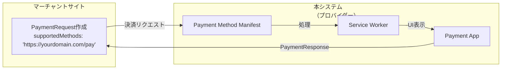
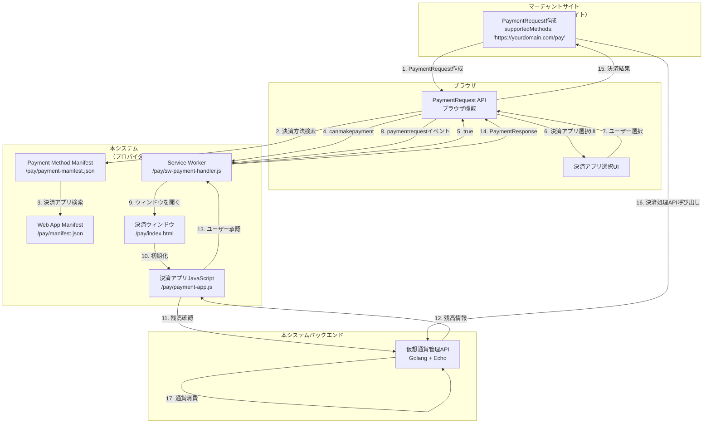
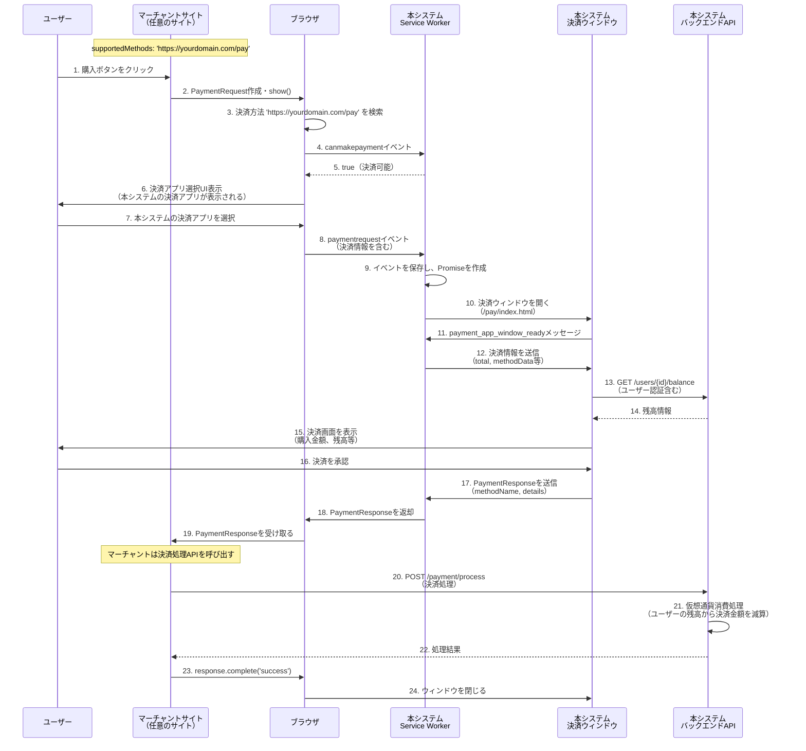

# PaymentRequest API プロバイダー実装ガイド

## 目次

1. [概要](#概要)
2. [PaymentRequest APIプロバイダーとは](#paymentrequest-apiプロバイダーとは)
3. [基本的な概念](#基本的な概念)
4. [アーキテクチャとコンポーネント](#アーキテクチャとコンポーネント)
5. [プロバイダー側の実装詳細](#プロバイダー側の実装詳細)
6. [本システムの実装](#本システムの実装)

## 概要

本ドキュメントは、**PaymentRequest APIのプロバイダー側（決済アプリ側）**として機能する実装ガイドです。

本システムは、`https://yourdomain.com/pay` という決済方法を提供するPayment Handlerを実装し、マーチャントサイトがこの決済方法を `supportedMethods` に指定できるようにします。ユーザーは保有する仮想通貨を使って、マーチャントサイトで販売されているデジタル商品（ゲーム内アイテム、コンテンツなど）を購入できます。

## PaymentRequest APIプロバイダーとは

### プロバイダーとマーチャントの関係



**マーチャント側**（決済を受け取る側）:
- デジタル商品（ゲーム内アイテム、コンテンツなど）を販売
- PaymentRequest APIを使用して決済をリクエスト
- `supportedMethods` に `'https://yourdomain.com/pay'` を指定
- 決済完了後、商品をユーザーに提供

**プロバイダー側**（本システム）:
- `https://yourdomain.com/pay` という決済方法を提供
- Payment Handler APIを使用して決済リクエストを処理
- ユーザーが保有する仮想通貨から決済金額を消費
- 決済処理を完了し、マーチャントに決済完了を通知

### 本システムの役割

本システムは以下の役割を担います：

1. **決済方法の提供**: `https://yourdomain.com/pay` という決済方法を登録
2. **決済リクエストの処理**: マーチャントからの決済リクエストを受け取り、処理
3. **仮想通貨の消費**: 決済が完了したら、ユーザーの仮想通貨残高から決済金額を消費
4. **ユーザー認証**: 決済アプリウィンドウでユーザーを認証
5. **残高管理**: ユーザーの仮想通貨残高を管理
6. **決済完了通知**: マーチャントに決済完了を通知

## 基本的な概念

### 1. 決済方法（Payment Method）

決済に使用する方法を識別するURL。本システムでは以下を提供します：

- **`https://yourdomain.com/pay`**: 本システムが提供する仮想通貨決済方法

マーチャントは以下のように使用します：

```javascript
const supportedMethods = [{
  supportedMethods: 'https://yourdomain.com/pay'
}];
```

### 2. Payment Handler API

Webベースの決済アプリを実装するためのAPI。本システムはこのAPIを使用して決済アプリを実装します。

### 3. 主要コンポーネント

プロバイダー側として実装する必要があるコンポーネント：

- **Payment Method Manifest**: 決済方法の定義
- **Web App Manifest**: 決済アプリの設定
- **Service Worker**: 決済リクエストの処理
- **決済アプリウィンドウ**: ユーザーが決済を承認するUI

## アーキテクチャとコンポーネント

### 全体構成（プロバイダー側の視点）



### 主要コンポーネント

#### 1. Payment Method Manifest

決済方法を定義するマニフェストファイル。どの決済アプリがこの決済方法を処理できるかを指定します。

**payment-manifest.json**
```json
{
  "default_applications": ["https://yourdomain.com/pay/manifest.json"],
  "supported_origins": [
    "https://yourdomain.com",
    "https://game.yourdomain.com"
  ]
}
```

#### 2. Web App Manifest

決済アプリの設定を定義するマニフェストファイル。

**manifest.json**
```json
{
  "name": "YourGame Currency",
  "short_name": "GameCurrency",
  "icons": [{
    "src": "icon.png",
    "sizes": "48x48",
    "type": "image/png"
  }],
  "serviceworker": {
    "src": "sw-payment-handler.js",
    "use_cache": false
  }
}
```

#### 3. Service Worker

決済リクエストを処理するService Worker。以下のイベントを処理します：

- `canmakepayment`: 決済可能かどうかの確認
- `paymentrequest`: 決済リクエストの処理

#### 4. 決済アプリウィンドウ

ユーザーが決済を承認するためのUI。Service Workerによって開かれます。

## 決済フローの詳細

### プロバイダー側の決済フロー



## プロバイダー側の実装詳細

### 1. Payment Method Manifestの実装

#### canmakepaymentイベント

```javascript
// sw-payment-handler.js
self.addEventListener('canmakepayment', (e) => {
  // 決済可能かどうかを返す
  // 例: ユーザーがログインしているか、残高があるかなどをチェック
  e.respondWith(true);
});
```

#### paymentrequestイベント

```javascript
// 現在の決済リクエストを保持
let currentPayment = {
  paymentRequestEvent: null,
  resolver: null
};

self.addEventListener('paymentrequest', async (e) => {
  // イベントとPromiseリゾルバを保存
  currentPayment.paymentRequestEvent = e;
  currentPayment.resolver = new PromiseResolver();
  
  // Promiseを返す（後でresolve/rejectされる）
  e.respondWith(currentPayment.resolver.promise);
  
  // 決済ウィンドウを開く
  try {
    const windowClient = await e.openWindow('https://yourdomain.com/pay/index.html');
    if (windowClient === null) {
      currentPayment.resolver.reject('Failed to open window');
    }
  } catch (err) {
    currentPayment.resolver.reject(err);
  }
});
```

#### 決済ウィンドウからのメッセージ受信

```javascript
self.addEventListener('message', (e) => {
  if (!currentPayment.resolver) {
    return; // 決済リクエストがない場合は無視
  }
  
  // 決済ウィンドウが準備完了
  if (e.data === 'payment_app_window_ready') {
    // 決済情報をウィンドウに送信
    sendPaymentRequestToClient();
    return;
  }
  
  // 決済承認
  if (e.data.methodName) {
    // PaymentResponseを返す
    currentPayment.resolver.resolve({
      methodName: e.data.methodName,
      details: e.data.details
    });
  } else {
    // キャンセルまたはエラー
    currentPayment.resolver.reject(e.data);
  }
});

function sendPaymentRequestToClient() {
  if (!currentPayment.paymentRequestEvent) return;
  
  // 決済情報をウィンドウに送信
  clients.matchAll({ type: 'window' }).then(clients => {
    clients.forEach(client => {
      client.postMessage({
        total: currentPayment.paymentRequestEvent.total,
        methodData: currentPayment.paymentRequestEvent.methodData,
        modifiers: currentPayment.paymentRequestEvent.modifiers
      });
    });
  });
}
```

### 2. Service Workerの実装

#### canmakepaymentイベント

```javascript
// public/pay/sw-payment-handler.js
self.addEventListener('canmakepayment', (e) => {
  // 決済可能かどうかを返す
  // 本システムでは常にtrueを返す（ユーザー認証は決済ウィンドウで行う）
  e.respondWith(true);
});
```

#### paymentrequestイベント

```javascript
// 現在の決済リクエストを保持
let currentPayment = {
  paymentRequestEvent: null,
  resolver: null
};

self.addEventListener('paymentrequest', async (e) => {
  // イベントとPromiseリゾルバを保存
  currentPayment.paymentRequestEvent = e;
  currentPayment.resolver = new PromiseResolver();
  
  // Promiseを返す（後でresolve/rejectされる）
  e.respondWith(currentPayment.resolver.promise);
  
  // 決済ウィンドウを開く
  try {
    const windowClient = await e.openWindow('https://yourdomain.com/pay/index.html');
    if (windowClient === null) {
      currentPayment.resolver.reject('Failed to open window');
    }
  } catch (err) {
    currentPayment.resolver.reject(err);
  }
});
```

#### 決済ウィンドウからのメッセージ受信

```javascript
self.addEventListener('message', (e) => {
  if (!currentPayment.resolver) {
    return; // 決済リクエストがない場合は無視
  }
  
  // 決済ウィンドウが準備完了
  if (e.data === 'payment_app_window_ready') {
    // 決済情報をウィンドウに送信
    sendPaymentRequestToClient();
    return;
  }
  
  // 決済承認
  if (e.data.methodName) {
    // PaymentResponseを返す
    currentPayment.resolver.resolve({
      methodName: e.data.methodName,
      details: e.data.details
    });
  } else {
    // キャンセルまたはエラー
    currentPayment.resolver.reject(e.data);
  }
});

function sendPaymentRequestToClient() {
  if (!currentPayment.paymentRequestEvent) return;
  
  // 決済情報をウィンドウに送信
  clients.matchAll({ type: 'window' }).then(clients => {
    clients.forEach(client => {
      client.postMessage({
        total: currentPayment.paymentRequestEvent.total,
        methodData: currentPayment.paymentRequestEvent.methodData,
        modifiers: currentPayment.paymentRequestEvent.modifiers
      });
    });
  });
}
```

### 3. 決済アプリウィンドウの実装

#### 初期化とService Workerとの通信

```javascript
// public/pay/payment-app.js
let paymentRequestClient;
let methodData;

function init() {
  // Service Workerからのメッセージを受信
  navigator.serviceWorker.addEventListener('message', handleServiceWorkerMessage);
  
  // Service Workerに準備完了を通知
  navigator.serviceWorker.controller.postMessage('payment_app_window_ready');
  
  // キープアライブ用のping（定期的に送信）
  setInterval(() => {
    navigator.serviceWorker.controller.postMessage('ping');
  }, 60000);
}

function handleServiceWorkerMessage(e) {
  paymentRequestClient = e.source;
  
  if (e.data.methodData) {
    // 決済情報を受信
    methodData = e.data.methodData;
    displayPaymentInfo(e.data);
    loadUserBalance(); // ユーザー残高を取得
  }
}
```

#### ユーザー認証と残高確認

```javascript
async function loadUserBalance() {
  try {
    // ユーザー認証（セッションまたはトークン）
    const authToken = await authenticateUser();
    
    // バックエンドAPIから残高を取得
    const response = await fetch('https://api.yourdomain.com/v1/users/current/balance', {
      headers: {
        'Authorization': 'Bearer ' + authToken
      }
    });
    
    if (!response.ok) {
      throw new Error('Failed to load balance');
    }
    
    const balance = await response.json();
    displayBalance(balance);
    
    // 購入金額を取得
    const totalAmount = parseFloat(methodData.total.amount.value);
    
    // 残高が不足している場合は警告を表示
    if (balance.balances.paid < totalAmount) {
      showInsufficientBalanceWarning();
      disablePaymentButton();
    } else {
      enablePaymentButton();
    }
  } catch (error) {
    console.error('Failed to load balance:', error);
    showError('残高情報の取得に失敗しました');
  }
}
```

#### 決済承認処理

```javascript
async function handlePaymentApproval() {
  if (!paymentRequestClient) return;
  
  // ユーザー認証トークンを取得
  const authToken = await getAuthToken();
  const userId = getUserIdFromToken(authToken);
  
  // PaymentResponseを作成
  const paymentResponse = {
    methodName: 'https://yourdomain.com/pay',
    details: {
      // 決済に必要な情報を設定
      userId: userId,
      transactionId: generateTransactionId(),
      timestamp: Date.now(),
      // 必要に応じて追加情報
      authToken: authToken // 注意: セキュリティを考慮してトークン化推奨
    }
  };
  
  // Service Workerに送信
  paymentRequestClient.postMessage(paymentResponse);
  
  // ウィンドウを閉じる
  window.close();
}

function handleCancel() {
  if (paymentRequestClient) {
    paymentRequestClient.postMessage('Payment cancelled by user');
  }
  window.close();
}
```

## 実装の詳細

### Payment Method Manifestの配信

決済方法を登録するには、Payment Method Manifestを適切な場所に配置し、HTTPヘッダーで参照する必要があります。

```javascript
// Express.jsの例
app.use((req, res, next) => {
  if (req.path === '/pay') {
    res.links({
      'payment-method-manifest': 'https://yourdomain.com/pay/payment-manifest.json'
    });
  }
  next();
});
```

### セキュリティ考慮事項

1. **HTTPS必須**: PaymentRequest APIはHTTPS環境でのみ動作します
2. **オリジン検証**: Payment Method Manifestで許可されたオリジンのみが使用可能
3. **認証**: 決済アプリウィンドウでは適切な認証を実装
4. **トークン化**: 決済情報は可能な限りトークン化して処理

### エラーハンドリング

```javascript
// マーチャント側
try {
  const response = await request.show();
  // 処理...
} catch (error) {
  if (error.name === 'AbortError') {
    // ユーザーがキャンセル
    console.log('User cancelled payment');
  } else if (error.name === 'NotSupportedError') {
    // ブラウザがサポートしていない
    console.error('PaymentRequest not supported');
  } else {
    // その他のエラー
    console.error('Payment error:', error);
  }
}
```

## 本システムの実装

### 実装の全体像

本システムは、PaymentRequest APIの**プロバイダー側**として、以下のコンポーネントを実装します：

1. **Payment Method Manifest** (`/pay/payment-manifest.json`)
2. **Web App Manifest** (`/pay/manifest.json`)
3. **Service Worker** (`/pay/sw-payment-handler.js`)
4. **決済アプリウィンドウ** (`/pay/index.html`, `/pay/payment-app.js`)
5. **バックエンドAPI** (Golang + Echo)

### ディレクトリ構造

```
public/
└── pay/                          # Payment Handler関連ファイル
    ├── payment-manifest.json     # Payment Method Manifest
    ├── manifest.json              # Web App Manifest
    ├── sw-payment-handler.js      # Service Worker
    ├── index.html                 # 決済アプリウィンドウ
    ├── payment-app.js             # 決済アプリJavaScript
    └── icon.png                   # アイコン
```

### APIエンドポイント

#### 1. 残高確認（決済ウィンドウから）

決済アプリウィンドウがユーザーの残高を確認するために使用します。

```
GET /api/v1/users/{user_id}/balance
Authorization: Bearer {token}

Response:
{
  "user_id": "user123",
  "balances": {
    "paid": "5000.00",
    "free": "1000.00"
  }
}
```

#### 2. 決済処理（マーチャントから）

マーチャントサイトが決済を完了するために呼び出すAPIです。このAPIはユーザーの仮想通貨残高から決済金額を**消費**します。決済が完了すると、マーチャントサイトはユーザーにデジタル商品（ゲーム内アイテム、コンテンツなど）を提供します。

```
POST /api/v1/payment/process
Authorization: Bearer {token}
Content-Type: application/json

Request:
{
  "payment_request_id": "pr_1234567890",
  "user_id": "user123",
  "method_name": "https://yourdomain.com/pay",
  "details": {
    "userId": "user123",
    "transactionId": "txn_abc123",
    "timestamp": 1234567890
  },
  "amount": "1000.00",
  "currency": "JPY"
}

Response:
{
  "transaction_id": "txn_1234567891",
  "payment_request_id": "pr_1234567890",
  "balance_after": "6000.00",
  "status": "completed"
}
```

### マーチャント側の使用例（参考）

マーチャントサイトは以下のように本システムの決済方法を使用します：

```javascript
// マーチャントサイト側の実装例（参考）
async function purchaseDigitalItem(itemId, itemName, price) {
  // 本システムの決済方法を指定
  const supportedMethods = [{
    supportedMethods: 'https://yourdomain.com/pay'
  }];
  
  const details = {
    total: {
      label: itemName, // 例: 'プレミアムスキン', '追加コンテンツパック'
      amount: {
        currency: 'JPY',
        value: price.toString()
      }
    }
  };
  
  const request = new PaymentRequest(supportedMethods, details);
  
  try {
    const response = await request.show();
    
    // 本システムのバックエンドAPIで決済処理
    const result = await fetch('https://api.yourdomain.com/v1/payment/process', {
      method: 'POST',
      headers: {
        'Content-Type': 'application/json',
        'Authorization': 'Bearer ' + getAuthToken()
      },
      body: JSON.stringify({
        payment_request_id: generatePaymentRequestId(),
        user_id: getCurrentUserId(),
        method_name: response.methodName,
        details: response.details,
        amount: amount.toString(),
        currency: 'JPY'
      })
    });
    
    const data = await result.json();
    
    if (data.status === 'completed') {
      await response.complete('success');
      // 決済が完了したので、デジタル商品をユーザーに提供
      provideDigitalItem(itemId);
    } else {
      await response.complete('fail');
      // エラー処理
    }
    
  } catch (error) {
    console.error('Payment failed:', error);
  }
}
```

**注意**: 上記はマーチャント側の実装例です。本システムが実装するのは**プロバイダー側**（決済アプリ側）です。

## まとめ

本システムは、PaymentRequest APIの**プロバイダー側（決済アプリ側）**として機能し、`https://yourdomain.com/pay` という決済方法を提供します。

### 本システムの役割

1. **決済方法の提供**: `https://yourdomain.com/pay` をマーチャントが使用可能にする
2. **決済リクエストの処理**: マーチャントからの決済リクエストを受け取り、処理
3. **仮想通貨の消費**: 決済完了後、ユーザーの仮想通貨残高から決済金額を消費
4. **ユーザー認証**: 決済アプリウィンドウでユーザーを認証
5. **残高管理**: ユーザーの仮想通貨残高を管理

### 実装のポイント

1. **Payment Method Manifest**: 決済方法を登録
2. **Service Worker**: 決済リクエストを処理
3. **決済アプリウィンドウ**: ユーザーが決済を承認するUI
4. **バックエンドAPI**: 仮想通貨の管理と決済処理

### 実装チェックリスト

- [ ] Payment Method Manifest (`/pay/payment-manifest.json`) の作成
- [ ] Web App Manifest (`/pay/manifest.json`) の作成
- [ ] Service Worker (`/pay/sw-payment-handler.js`) の実装
- [ ] 決済アプリウィンドウ (`/pay/index.html`, `/pay/payment-app.js`) の実装
- [ ] バックエンドAPI (`/api/v1/payment/process`) の実装
- [ ] ユーザー認証機能の実装
- [ ] 残高確認API (`/api/v1/users/{id}/balance`) の実装
- [ ] HTTPS設定
- [ ] テストとデバッグ

## 参考リンク

- [Payment Request API - MDN](https://developer.mozilla.org/ja/docs/Web/API/Payment_Request_API)
- [Payment Handler API - W3C](https://www.w3.org/TR/payment-handler/)
- [Payment Request API - W3C](https://www.w3.org/TR/payment-request/)
- [Web-based Payment Apps Overview - web.dev](https://web.dev/web-based-payment-apps-overview/)
